# FOVI240110 project on "Artificial Intelligence and Robotics for Remote and Proximal Sensing in Precision Agriculture"
## Fondo de Vinculación Internacional (FOVI) ANID

Project executed between December 30th, 2024 and June 29th, 2026 (including an approved 6-month extension). The project has now concluded — the final technical report has been submitted to ANID, and this page summarizes the network, activities and results achieved. 

Project led by [Universidad de O'Higgins](https://sites.google.com/uoh.cl/uoh-ris-lab/) (Chile), in collaboration with [L3S Research Center](https://www.l3s.de/) / Leibniz Universität Hannover (Germany), [ENS Paris-Saclay](https://centreborelli.ens-paris-saclay.fr/en) (France), [Universidad de la República](https://udelar.edu.uy/portal/) (Uruguay), [Universidad Católica del Uruguay](https://www.ucu.edu.uy/) (Uruguay), and [Universidad de Chile](https://ingenieria.uchile.cl/), [Pontificia Universidad Católica de Chile](https://www.uc.cl/), [Universidad del Bío Bío](https://www.ubiobio.cl/w/), and [Universidad Técnica Federico Santa María](https://www.usm.cl/) (incorporated to the network in 2026), Chile.

The project's focus was the use of artificial intelligence and robotics — in particular implicit neural representations such as Neural Radiance Fields (NeRF) and 3D reconstruction techniques — for remote sensing (satellite imagery) and proximal sensing (robotics and sensor networks) applied to precision agriculture, with case studies in fruit growing in the central-southern macrozone of Chile.

Some of the researchers and students involved in the project are:
- [Karen Mesa](https://scholar.google.com/citations?user=Kr2g5dUAAAAJ&hl=en&oi=ao), Universidad de O'Higgins, Chile — Project Director (since March 2026),
- [Rodrigo Verschae](https://scholar.google.com/citations?user=Fv1lZNkAAAAJ&hl=en), Universidad Técnica Federico Santa María, Chile — Project Director (until March 2026), founding Director,
- [Daniel Casagrande](https://scholar.google.com/citations?user=CxOD_YMAAAAJ&hl=en&oi=ao), Universidad de O'Higgins, Chile — Alternate Director (since March 2026)
- [Gabriele Facciolo](https://scholar.google.com/citations?user=gAGVgXsAAAAJ&hl=en), ENS Paris-Saclay, France
- [Nicolas Navarro-Guerrero](https://scholar.google.com/citations?user=SeQvYQ0AAAAJ&hl=en), L3S Research Center, Hannover University, Germany
- [Gonzalo Tejera](https://dblp.org/pid/71/3052.html), Universidad de la República, Uruguay
- [J. Matias Di Martino](https://scholar.google.com/citations?user=rGHOw04AAAAJ&hl=es), Universidad Católica del Uruguay, Uruguay
- [Javier Preciozzi](https://scholar.google.com/citations?user=Rcstv44AAAAJ&hl=en), Universidad de la República, Uruguay
- [Javier Ruiz-del-Solar](https://scholar.google.com/citations?user=U0XHBs8AAAAJ&hl=en), Universidad de Chile, Chile
- [Cristóbal Quiñinao](https://scholar.google.com/citations?user=v2Tv6ZQAAAAJ&hl=es), Universidad Católica de Chile, Chile
- [Christopher Flores](https://scholar.google.com/citations?user=YKqQOkUAAAAJ&hl=en&oi=ao), Universidad del Biobío, Chile
- Enric Meinhardt-Llopis, ENS Paris-Saclay (Centre Borelli), France — international visiting researcher
- Ariel Zuñiga, Nicolas Araya and Luis Cossio, graduate students, Universidad de O'Higgins / Universidad de Chile

## Project results at a glance

- Both the general objective and all four specific objectives of the project were fully met.
- The international network was consolidated across Chile, Uruguay, France and Germany, with the incorporation of Universidad Técnica Federico Santa María in 2026.
- 4 seminars/talks were organized (1 online, 3 in-person), plus repeat presentations hosted at partner universities.
- 6 international research stays were completed (Modalities A and B), by students and researchers travelling to/from France, Germany and Uruguay.
- 2 journal/workshop publications and 2 Master's theses were produced.
- 2 participants began doctoral studies as a direct outcome of the project.
- The project participated in the Latin American Robotics Summer School (LACORO 2025) and in international conferences CVPR 2025 and WACV 2026.

## Activities: Online Seminar 1

📅 Date: May 7th, 2025, 8:00 - 9:30 CLT 🇨🇱 | 9:00 - 10:30 UYT 🇺🇾 | 14:00 - 15:30 CET 🇫🇷 🇩🇪 | 21:00 - 22:30 JST 🇯🇵

First Online Seminar of the FOVI240110 project on Artificial Intelligence and Robotics for Remote and Proximal Sensing in Precision Agriculture.

📌 Seminar topic: 3D modelling in Outdoor Images and Satellite Images

💡 Talks:
1. *Outdoor 3D capture with polarization*, [Shohei Nobuhara](https://scholar.google.co.jp/citations?user=keXiLQ0AAAAJ) (Kyoto Institute of Technology, Japan)
2. *S-EO A Large-Scale Dataset for Geometry-Aware Shadow Detection in Remote Sensing Applications*, [Elias Masquil](https://scholar.google.com/citations?user=eJU1kjEAAAAJ&hl=en) (Universidad de la República, Uruguay)

## Activities: In-person Seminar — Multi- and Hyper-spectral Satellite Imaging

📅 Date: July 17th, 2025, 11:00 CLT 🇨🇱 — Sala de Consejo ICI, Edificio B, Campus Rancagua, Universidad de O'Higgins

Seminar of the FOVI240110 project on Artificial Intelligence and Robotics for Remote and Proximal Sensing in Precision Agriculture.

📌 Seminar topic: Multi- and Hyper-spectral Satellite Imaging, [Enric Meinhardt-Llopis](https://centreborelli.ens-paris-saclay.fr/fr/annuaire-des-personnes/enric-meinhardt-llopis) (ENS Paris-Saclay, France)

This talk was repeated at two additional host institutions during Enric Meinhardt-Llopis' research stay in Chile:
- October 20th, 2025 — Pontificia Universidad Católica de Chile, Santiago
- October 22nd, 2025 — Universidad de Chile, Santiago (organized by Patricio Loncomilla)

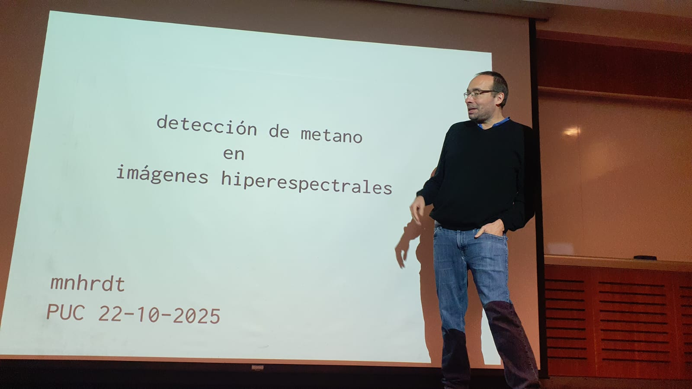
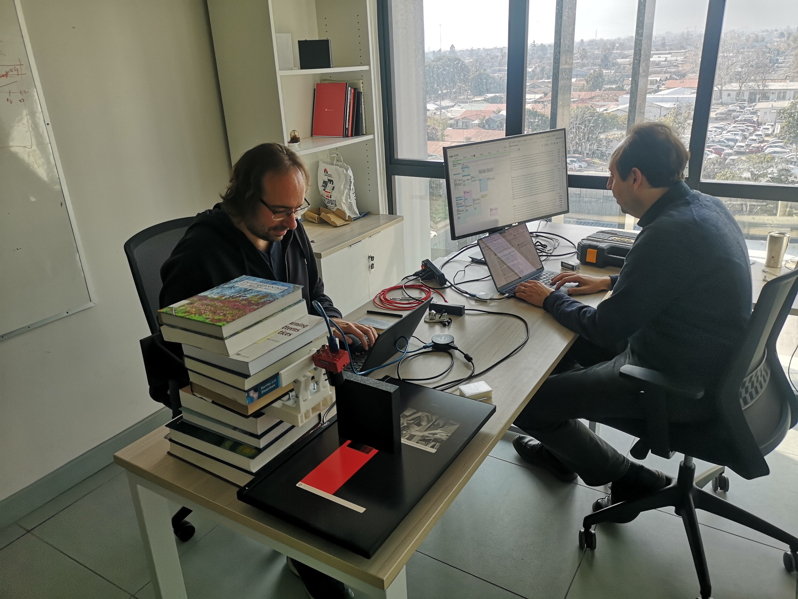

## Activities: Seminar N°2 — LACORO 2025 (Latin American Robotics Summer School)

📅 Date: December 11th, 2025 — Universidad de O'Higgins, Rancagua, Chile

Project seminar held in the context of the Latin American Robotics Summer School (LACORO 2025), with participation of Matías Di Martino (Universidad Católica del Uruguay) and Nicolas Navarro-Guerrero (Hannover University, Germany), together with the UOH and Universidad de Chile teams.

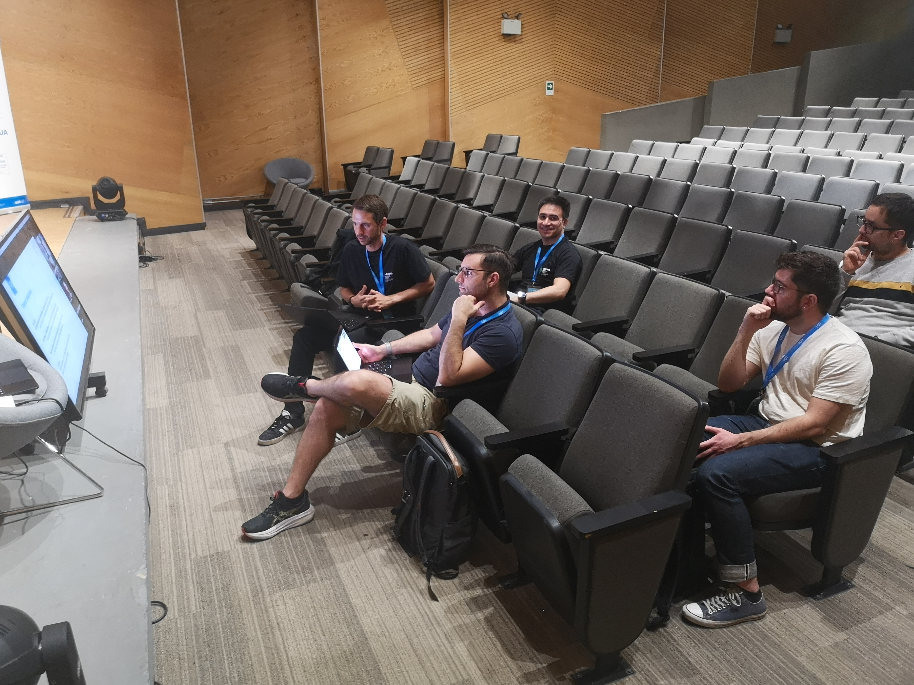
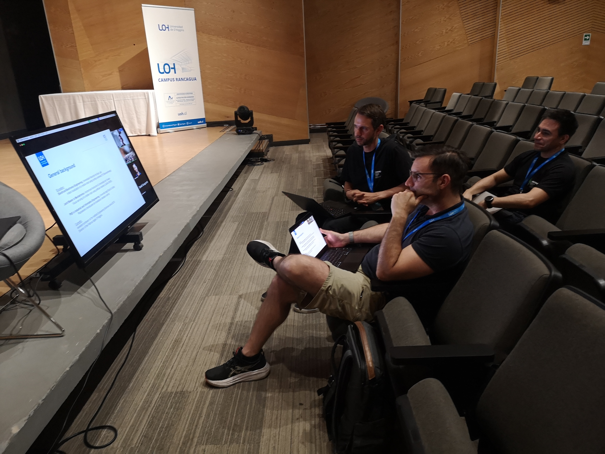
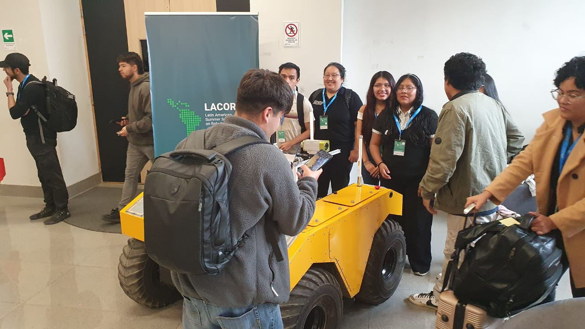
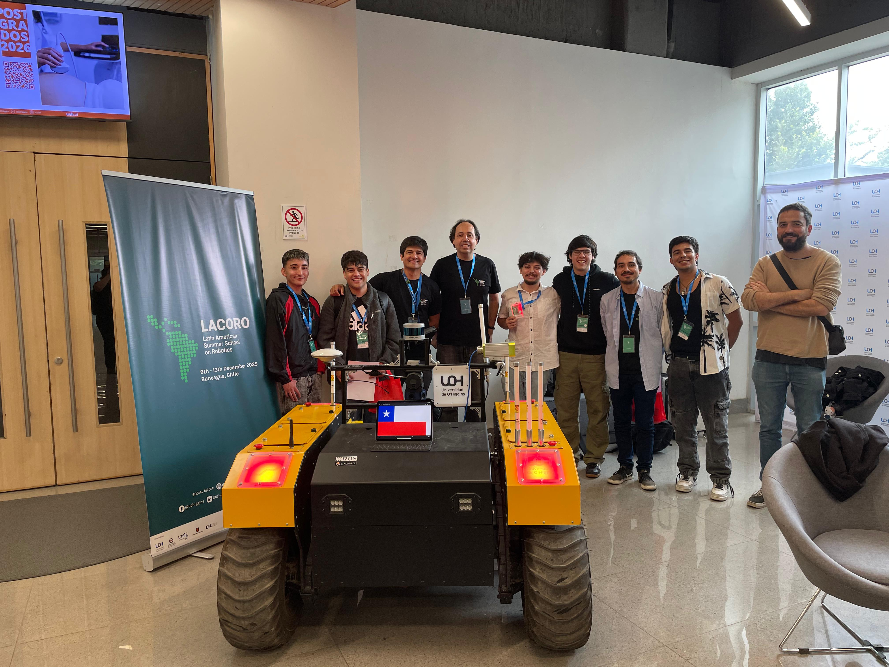

## Activities: Seminar N°3 — Montevideo, Uruguay

📅 Date: June 17th, 2026 — INIA, Montevideo, Uruguay

Third in-person seminar of the project network, held during a joint research visit to Universidad de la República (UdelaR) and Universidad Católica del Uruguay (UCU), with participation of Karen Mesa, Daniel Casagrande, Luis Cossio and Rodrigo Verschae, and hosted by Gonzalo Tejera (UdelaR).

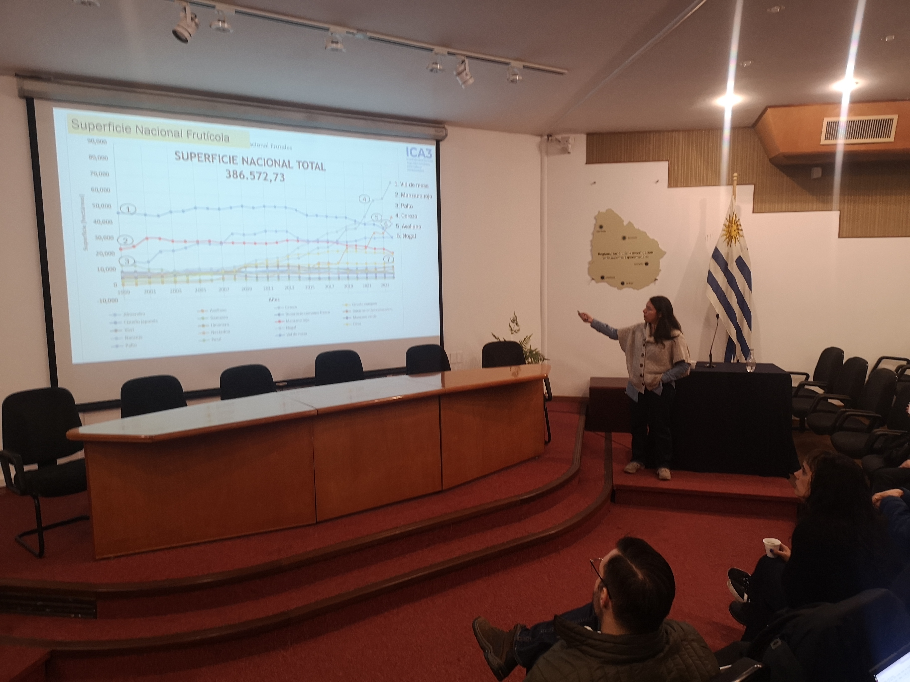
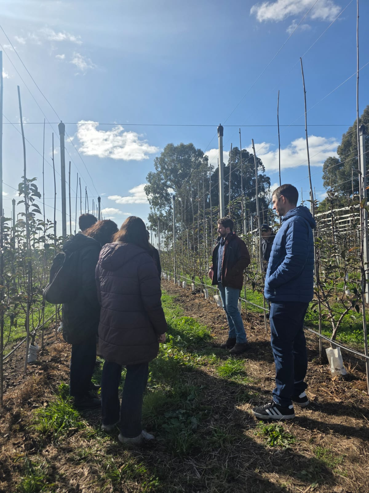
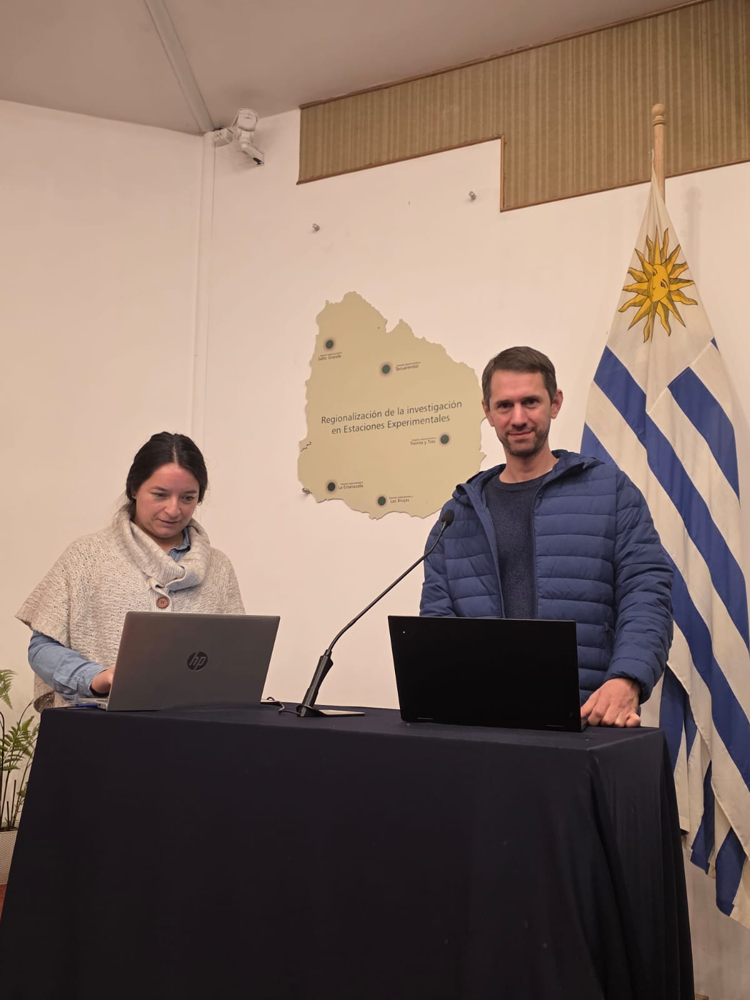
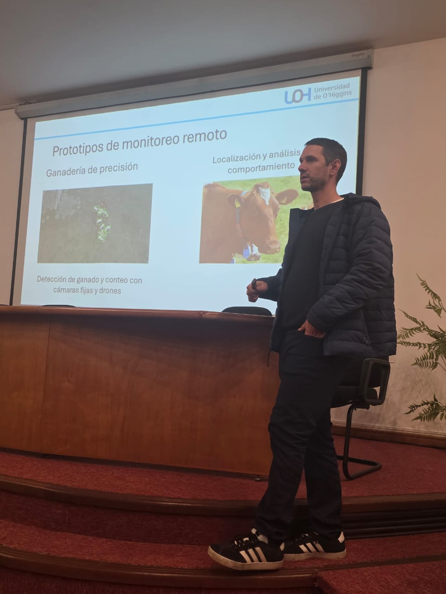
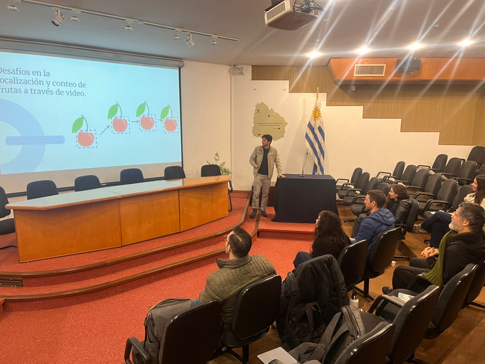
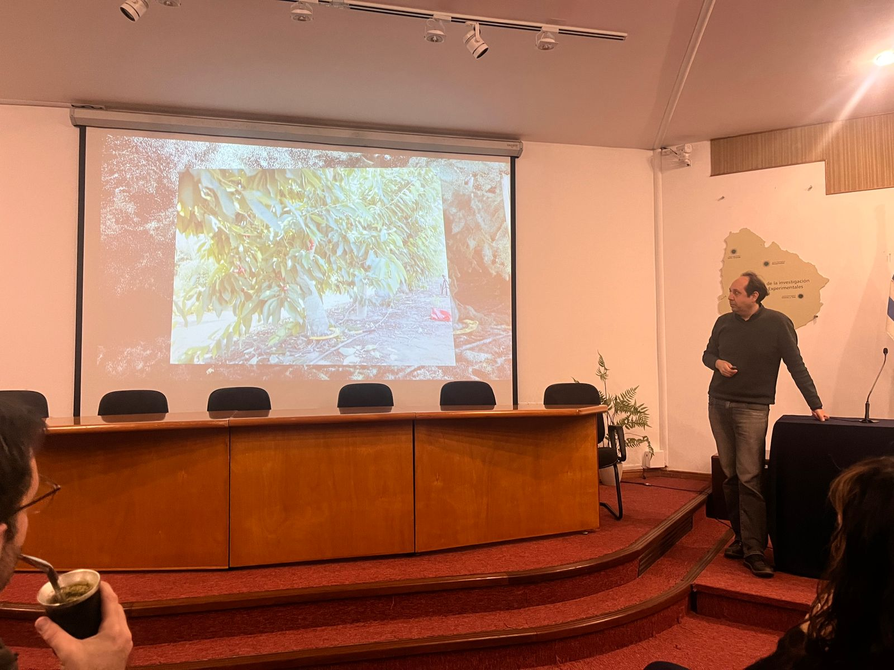
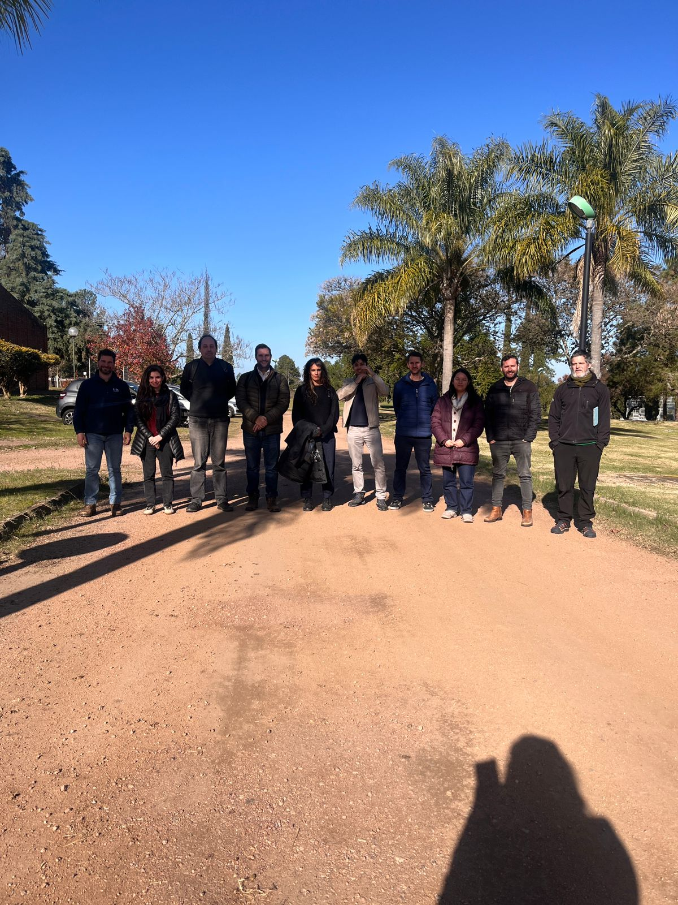
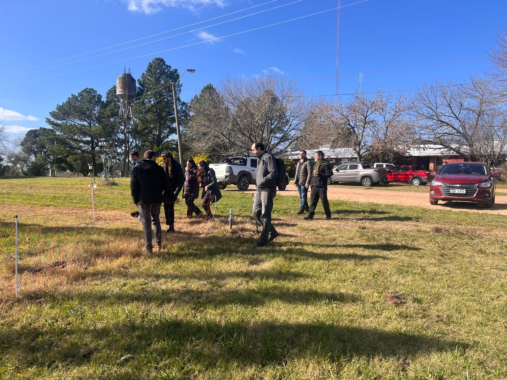

## Research stays and student exchanges

As part of the project's international mobility (Modalities A and B), the following research stays were completed:

| Researcher/Student | Destination | Period |
|---|---|---|
| Ariel Zuñiga | ENS Paris-Saclay, France | Jan–Feb 2025 |
| Luis Cossio | ENS Paris-Saclay, France | Jan 21 – Feb 25, 2026 |
| Nicolas Araya | L3S Center, Hannover University, Germany | Feb 9 – Mar 10, 2026 |
| Enric Meinhardt-Llopis | Universidad de O'Higgins, Chile (from ENS Paris-Saclay) | Jul & Oct 2025 |
| Matías Di Martino | Universidad de O'Higgins, Chile (from UCU, Uruguay) | Dec 2025 |
| Nicolas Navarro-Guerrero | Universidad de O'Higgins, Chile (from Hannover University) | Dec 2025 |
| Karen Mesa, Rodrigo Verschae, Daniel Casagrande, Luis Cossio | Universidad de la República / UCU, Uruguay | Jun 14–24, 2026 |

The project's researchers also presented results at international conferences: CVPR 2025 (Nashville, USA) and WACV 2026 / Workshop HARVESTVision (Tucson, USA).

## Publications

1. Luis Cossio, Cristóbal Quiñinao, Rodrigo Verschae, *"Orchard Sweet Cherry Color Distribution Estimation from Wireless Sensor Networks and Video-based Fruit Detection"*, Computers and Electronics in Agriculture, 2025.
2. Ariel Zuñiga-Santana, Gabriele Facciolo, Shohei Nobuhara, Rodrigo Verschae, *"A Multi-View Photometric Stereo Pipeline for Specular 3D Fruit Reconstruction"*, WACV 2026, Workshop HARVESTVision, 2026.

## Theses

1. *"3D Reconstruction of Cherries Using Photometric Stereo and Implicit Neural Representations"*, Ariel Zuñiga (Universidad de O'Higgins), with participation of Gabriele Facciolo (France, co-advisor) and Daniel Casagrande (UOH).
2. *"Mask-Guided Candidate Regions in Neural Radiance Fields and Applications in Robotics and Agriculture"*, Nicolas Araya (Universidad de O'Higgins), with participation of Nicolas Navarro-Guerrero (Germany, co-advisor) and Daniel Casagrande (UOH).

## Looking ahead

Universidad de O'Higgins and Universidad de Chile will continue to develop the network through joint co-supervision of students and researchers, joint publications, and new international collaboration proposals (STIC-AmSud, ECOS-Sud, DFG, DAAD) — a STIC-AmSud proposal is currently being prepared, and a proposal to Uruguayan funds on the project's topics has recently been submitted. The network also plans to keep organizing periodic online seminars (about one per year) and to link with related initiatives such as LACORO and Khipu, and to extend the capabilities developed to other crops of the central-southern macrozone.

## Contact

+ Email: rodrigo [at] verschae [dot] org
